# Setup Your Windows

This repo lists softwares I used and the configurations.
I try to make my windows easy to use and note down the configurations.
There are many alternatives for what I listed below.

<!-- toc -->

- [System Setting](#system-setting)
  * [Console Fonts](#console-fonts)
  * [Command Prompt](#command-prompt)
  * [Show Desktop Icons](#show-desktop-icons)
- [Softwares](#softwares)
  * [7Zip](#7zip)
  * [cmake](#cmake)
  * [Git](#git)
  * [GVIM](#gvim)
  * [LLVM](#llvm)
  * [Node](#node)
  * [GnuWin32 related EXEs](#gnuwin32-related-exes)
  * [Python2.7](#python27)
  * [Putty](#putty)
  * [AutoHotKey](#autohotkey)
  * [Total Commander](#total-commander)
  * [Visual Studio](#visual-studio)
- [Other Softwares that I used](#other-softwares-that-i-used)
  * [SPlayer](#splayer)
  * [Picassa](#picassa)
  * [Divvy](#divvy)
  * [Everything](#everything)
  * [BCompare](#bcompare)
  * [Firefox](#firefox)
  * [Notepad++](#notepad)
  * [WinSCP](#winscp)

<!-- tocstop -->

## System Setting

### Console Fonts
1. Install font `consolas-powerline` from directory `consolas-powerline`: `git submodule init && git submodule update`

### Command Prompt
1. Add `Command Prompt Here` to context menu: [CommandPromptHere.reg](./Registry/CommandPromptHere.reg)
2. Open Command Prompt -> Right Click on Title Bar -> Properties/Default ->
	- Font (Consolas)
	- Font Size (20px)
	- Colors (Opacity: 75) \
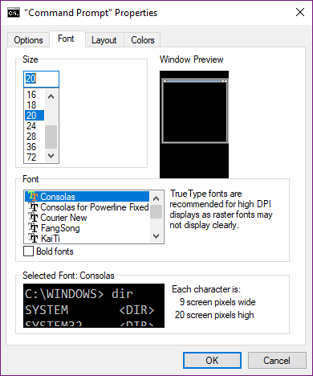
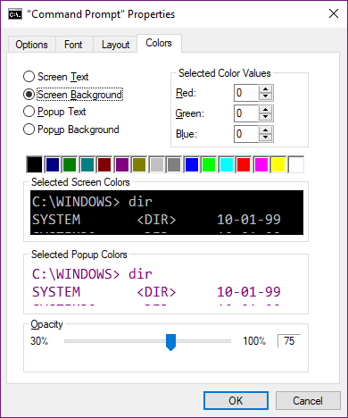

### Show Desktop Icons

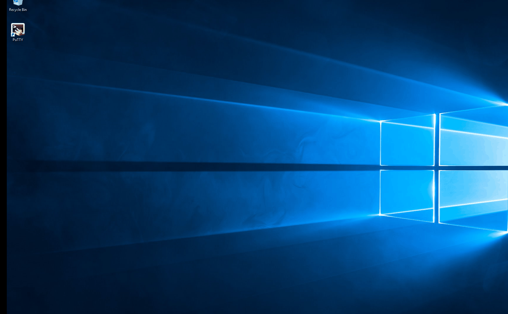

## Softwares
(Some softwares are not easy to find and can be downloaded [here](https://github.com/YanlongLi/Softwares))

### 7Zip
After Intallization, open `7zip File Manager` as Administrator, `Tools` -> `Options` -> `System` -> `+` \
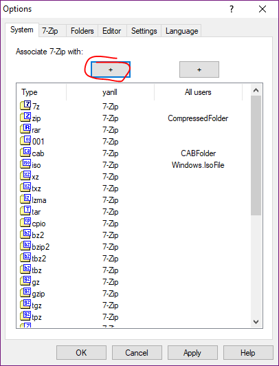

### cmake
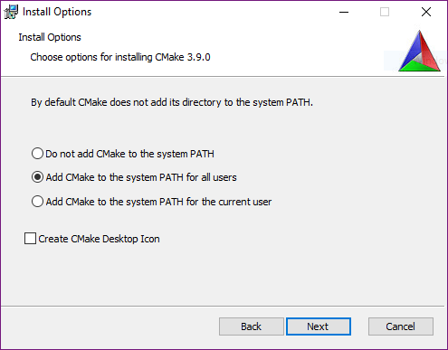

Essential for some GVIM plugin

Rounded tabs in Firefox Quantum: [photon-australis](https://github.com/wilfredwee/photon-australis)

### Git
1. Uncheck `Git Bash Here`, `Git GUI Here`, `Associate *` \
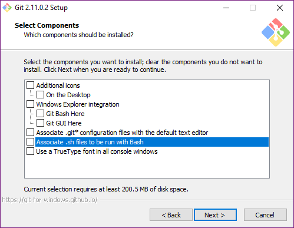
2. Check `Use Git from the Windows Command Prompt` \
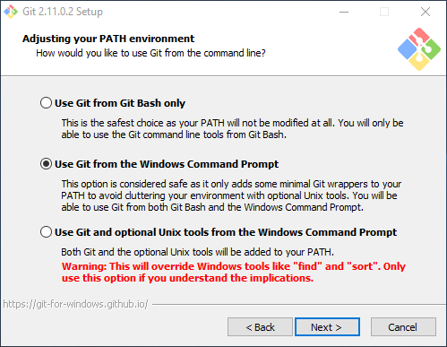
3. Other default
4. If you use GitBash, you can copy [.minttyrc](./.minttyrc) to your %HOME% directory

### GVIM
1. Select `Create .bat file` \
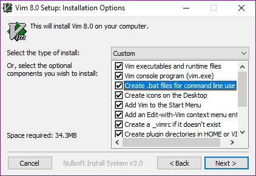
2. Change Desitination Directory \
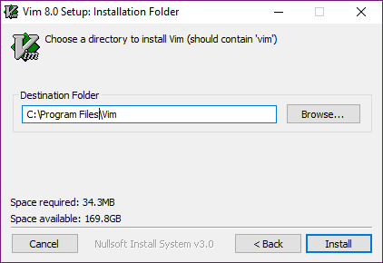
3. Replace `C:\Program Files\Vim\vim80` with corresponding content of `gvim_<version>_x64.zip`
4. Unzip `lua-<version>_Win64_bin.zip` to `C:\Program Files\Vim\vim8`
5. Add `Edit With Vim` to Context Menu: [EditWithVim.reg](./Registry/EditWithVim.reg) (change gvim path if you installed vim at a different path)

Install Astyle (used to format code) \
Unzip `Astyle_<version>_windows.zip` to a folder and add `bin` directory to system PATH

### LLVM
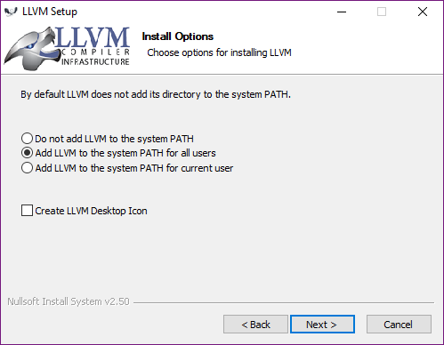

Essential for some GVIM plugin

### Node
Essential for some GVIM plugin

### GnuWin32 related EXEs
1. All default configurations
2. Add path `C:\Program Files (x86)\GnuWin32\bin` to environment Path \
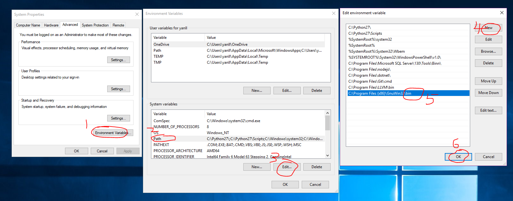

- coreutils
- findutils
- gawk
- grep
- make
- sed
- which

### Python2.7
Select add to ENV Path

Essential for some GVIM plugin

### Putty
Copy PuTTY.exe to any directory like `D:\Gosh\PuTTY\`

Configurations:
1. You may want to generate your private/public ssh key at `%HOME%\.ssh\`
2. Base Configuration: [PuTTY.reg](./Registry/PuTTY.reg), _CAUTION!: change the user name to yours._
3. Add a session (manually or base on my template)
```
Open a Command Prompt Under Directory Registry
> "C:\Program Files\Git\bin\bash"
$ ./PuTTY_Session_Create.sh > session.reg ### Then input the Session Name, Host Name, User Name
You can modify the file before adding registry
```
4. Use [PuTTY_Session_Backup.bat](./Registry/PuTTY_Session_Backup.bat) to backup your PuTTY registry (saved to desktop)
5. Set the pageant start with windows if you use SSH. (better to encryto your ssh private key, HOWTO). \
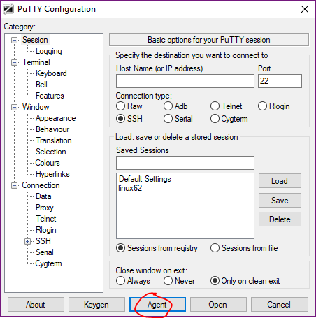
Then `pageant` appears in your system tray, right click, choose `start with windows`.

In my template:
1. Add remote command `tmux -u attach || tmux -u new`
2. Change `Blue` color schema, un-readable using original blue color

Create Shortcut for Session: add parameter `--load <session name>` \
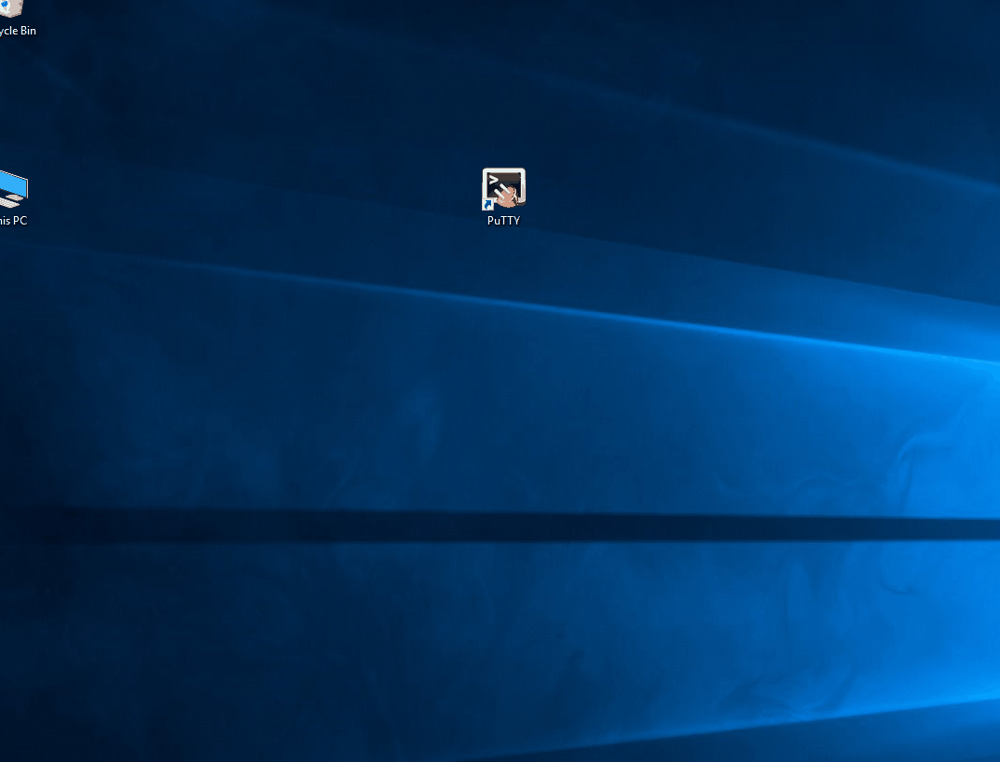

### AutoHotKey
(map CapsLock to ESC)
[CapsLock.ahk](./AutoHotKey/CapsLock.ahk)

### Total Commander 
(optional, as you need) \
Configurations
1. Copy `GHISLER` to `%APPDATA%\GHISLER` \
command: `robocopy GHISLER "%APPDATA\GHISLER%" /MIR`
2. Add `Total Commander Here` to context menu: [TotalCommanderHere.reg](./Registry/TotalCommanderHere.reg) \
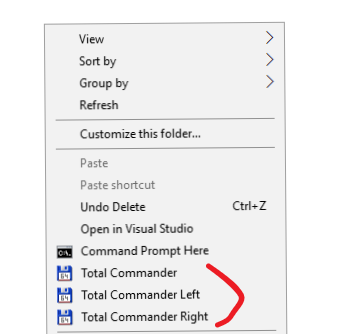

Shortcut Mapping:
- ESC=cm_ClearAll
- C+L=cm_EditPath
- F2=cm_RenameOnly
- C+F=cm_ShowQuickSearch
- CS+F=cm_SrcAllFiles
- C+S=cm_FileSync
- C+ENTER=cm_SrcQuickview
- CS+ENTER=cm_SrcHideQuickview


### Visual Studio
[Extensions](./VisualStudio/Extensions.md)

## Other Softwares that I used

### SPlayer
Video player

### Picassa
Photo viewer

### [Divvy](http://mizage.com/divvy/)
Used for window management

### Everything
Search disk files, very quick.

### BCompare
File or directory comparison

### Firefox
Browser \
[Plugins I used](./Firefox/Plugins.md)

### Notepad++
(configuration optional, in my configuration, I just disabled `Remember Last File`)
1. `Notepad++` directory => %APPDATA%\Roaming\Notepad++\ 
`robocopy "Notepad++" "%APPDATA%\NotePad++"`

### WinSCP
- Download/Upload file from/to remote Linux Server
- Complement for PuTTY

